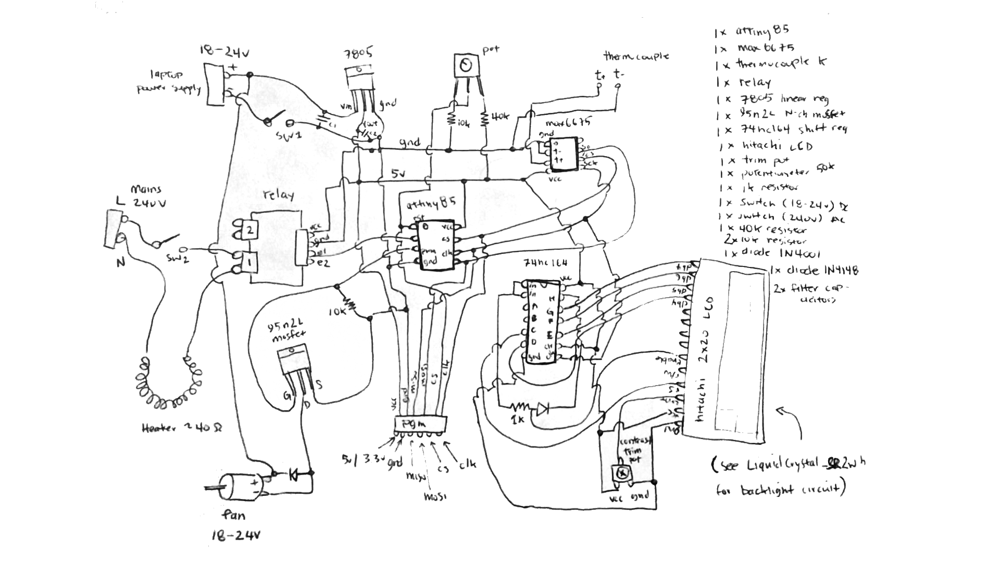

# tinyroaster

Arduino sketch for ATtiny85 or similar to be used in a coffee roasting controller board.

The design uses an ATtiny85 (see sketch for pinouts), MAX6675 temperature amplifier and type K thermocouple, 74HC165 shift register for interfacing with a Hitatchi compatible LCD in 4-bit mode.

The controller board manages timing, heater (via relay) and fan speed (~20V PWM) of a modified hot-air popcorn maker to roast small quantities of beans (40-100g).

## Operation

When the tinyroaster is powered on (SW1), the user is presented with three modes: Manual, Temperature, Profile. Manual mode lets the user control the fan speed with the pot and the heater with the heater override switch (SW2).

In Temperature mode, the user first chooses the fan speed (70, 80, 90 or 100% duty cycle), and then controls the temperature with the pot (range is set from 0-280C).

In Profile mode, the user can choose from one of the pre-programmed profiles. Currently those are Light, City, City+, Vienna, French. The roast then begins and progresses until the end, at which point the beans are cooled to around 50C and the roast is stopped.

## Hot-air popper modifications

In order to control the heater and fan independently, the fan must be decoupled from the heater. How you do this depends on the brand/model. There are lots of resources online already for how to do this, such as http://www.instructables.com/id/Build-a-Controllable-Coffee-Roaster-from-an-Air-Po/ and https://ineedcoffee.com/poplite-coffee-roaster/

## Schematic and parts list

The parts were mostly what I had lying around, which explains why some bizarre design decisions were made.

## Programming

A programmer header dangles out of the case so that I can connect a Bus Pirate and flash new software and roasting profiles using the Arduino IDE.

## Notes
### I/O pins
The ATtiny85 only has 5 I/O pins available, 6 if you can hold reset (pin 1) high enough while doing something useful with it. The 40k and 10k resistors do this, and allow us to read the potentiometer connected to this pin. This pot is the only user input, so it controls the fan speed, temperature, menu system, depending on what mode we're in.

The LCD uses a 74HC164 shift register, which needs 2 pins (data, clock). The MAX6675 thermocouple IC needs three pins (/cs, clock, data). Heater relay one pin, fan PWM one pin. To get around the shortage I share pins between the shift register and MAX6675. This mostly works well, with some caveats. The LCD update code in the Arduino sketch needs a few hacks to make it run without corruption. I arrived at this mostly by trial and error. This could all be easily solved by using an Arduino compatible microcontroller with more I/O pins.

### Emergency cool-down mode
If a roast fails or stops prematurely, leaving the beans in the hot chamber can be dangerous. An emergency mode is therefor accessible by turning the pot all the way to the right and resetting the tinyroaster with the power switch (SW1). In this mode the fan is at 100% duty cycle and the heater is disabled, quickly cooling the chamber.

